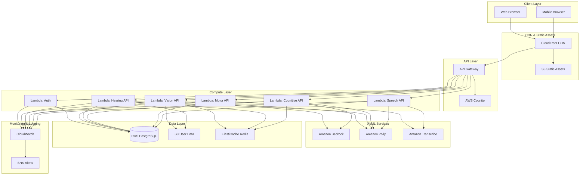

# Design Document: OmniAble AWS Migration

## Overview

This design document specifies the AWS cloud-native architecture for the OmniAble accessibility platform. The platform migrates from a Flask monolith with local SQLite storage to a scalable, serverless AWS infrastructure optimized for the AI for Bharat Hackathon.

The design maintains all existing functionality across five accessibility modules (Vision, Hearing, Cognitive, Motor, Speech) while introducing:
- Serverless compute with AWS Lambda/App Runner
- Managed authentication with AWS Cognito
- AI/ML services with Amazon Bedrock, Polly, and Transcribe
- Scalable data persistence with RDS PostgreSQL
- Global content delivery with CloudFront
- Regional language support for Bharat users

## Architecture

### High-Level Architecture Diagram



### Architecture Decisions

**1. Compute: AWS Lambda vs App Runner**

Decision: Use AWS Lambda for API endpoints

Rationale:
- Event-driven workload fits Lambda's execution model
- Pay-per-request pricing optimizes costs for variable traffic
- Native integration with API Gateway and other AWS services
- Cold start mitigation through provisioned concurrency for critical endpoints
- Each module gets dedicated Lambda functions for isolation

Alternative considered: AWS App Runner would simplify container deployment but increases baseline costs with always-on instances.

**2. Database: RDS PostgreSQL vs DynamoDB**

Decision: Use RDS PostgreSQL

Rationale:
- Existing SQLite schema maps directly to PostgreSQL
- ACID transactions for diary/goals/routines data integrity
- Complex queries for user analytics and reporting
- Familiar SQL interface reduces migration complexity
- Automated backups and point-in-time recovery

Alternative considered: DynamoDB offers better scalability but requires data model redesign and eventual consistency trade-offs.

**3. Authentication: AWS Cognito vs Custom JWT**

Decision: Use AWS Cognito User Pools

Rationale:
- Managed service eliminates authentication infrastructure maintenance
- Built-in password policies, MFA, and account recovery
- JWT token generation and validation
- Integration with API Gateway authorizers
- Compliance with security best practices

**4. AI Services: Amazon Bedrock vs HuggingFace API**

Decision: Use Amazon Bedrock with fallback to HuggingFace

Rationale:
- Bedrock provides enterprise-grade AI with AWS integration
- Claude Sonnet for image captioning and text simplification
- Lower latency within AWS network
- Maintain HuggingFace as fallback for cost optimization
- Unified billing and monitoring

**5. Static Assets: S3 + CloudFront vs S3 alone**

Decision: Use S3 with CloudFront CDN

Rationale:
- CloudFront edge locations across India reduce latency
- HTTPS termination at edge
- Caching reduces S3 request costs
- DDoS protection via AWS Shield
- Custom domain support

## Components and Interfaces

### 1. Authentication Service (AWS Cognito + Lambda)

**Purpose**: Manage user registration, login, password reset, and JWT token issuance.

**Components**:
- AWS Cognito User Pool: User identity store
- Lambda Authorizer: Custom JWT validation for API Gateway
- Lambda Functions: Registration handler, login handler, profile management

**Interfaces**:

```typescript
// POST /api/auth/register
interface RegisterRequest {
  email: string;
  name: string;
  password: string;
  disability_type?: string;
}

interface RegisterResponse {
  success: boolean;
  user_id: string;
  message: string;
}

// POST /api/auth/login
interface LoginRequest {
  email: string;
  password: string;
  remember?: boolean;
}

interface LoginResponse {
  success: boolean;
  token: string;
  expires_in: number;
  user: {
    id: string;
    name: string;
    email: string;
    disability_type?: string;
  };
}

// POST /api/auth/logout
interface LogoutResponse {
  success: boolean;
  message: string;
}

// POST /api/auth/reset-password
interface ResetPasswordRequest {
  email: string;
}

interface ResetPasswordResponse {
  success: boolean;
  message: string;
}
```

**Implementation Details**:
- Cognito User Pool configured with password policy: min 8 chars, uppercase, lowercase, number
- Custom attributes for disability_type
- Email verification required for registration
- JWT tokens valid for 24 hours
- Refresh tokens valid for 30 days
- Lambda authorizer validates JWT signature and expiration

### 2. Vision Module (Lambda + Bedrock + Polly + S3)

**Purpose**: Provide AI image description, text-to-speech, and visual accessibility features.

**Components**:
- Lambda Function: Image analysis orchestrator
- Amazon Bedrock: Claude Sonnet for image captioning
- Amazon Polly: Multi-language TTS
- S3 Bucket: User-uploaded images (temporary storage)
- ElastiCache: Cache for frequent image descriptions

**Interfaces**:

```typescript
// POST /api/vision/analyze-image
interface AnalyzeImageRequest {
  image: string; // base64 encoded
  format: 'jpeg' | 'png' | 'webp';
  language?: string; // for TTS
}

interface AnalyzeImageResponse {
  success: boolean;
  description: string;
  raw_caption: string;
  audio_url?: string; // Polly TTS output
  confidence: number;
}

// POST /api/vision/tts
interface TTSRequest {
  text: string;
  language: string; // 'en-IN', 'hi-IN', 'bn-IN', 'ta-IN', 'te-IN', 'mr-IN'
  voice?: string;
}

interface TTSResponse {
  success: boolean;
  audio_url: string;
  duration_ms: number;
}

// GET /api/vision/settings
// PUT /api/vision/settings
interface VisionSettings {
  theme: 'light' | 'dark' | 'high-contrast';
  font_size: number; // 12-32
  braille_mode: boolean;
  tts_language: string;
  tts_voice: string;
}
```

**Implementation Details**:
- Images uploaded to S3 with 24-hour lifecycle policy
- Bedrock Claude Sonnet invoked with vision capabilities
- Image descriptions enhanced with context (e.g., "This image shows: ...")
- Polly generates MP3 audio at 24kbps
- Audio files stored in S3 with 1-hour expiration
- ElastiCache stores image hash → description mapping (1 hour TTL)
- Settings persisted in RDS user_settings table

### 3. Hearing Module (Lambda + MediaPipe + S3)

**Purpose**: Convert text to sign language animations (ISL/ASL) and recognize sign language from video.

**Components**:
- Lambda Function: Sign language orchestrator
- S3 Bucket: Sign language dictionaries (JSON), landmark data
- MediaPipe: Client-side hand/face tracking (JavaScript library)
- Lambda Function: Video generation for sign animations

**Interfaces**:

```typescript
// POST /api/hearing/text-to-sign
interface TextToSignRequest {
  text: string;
  language: 'isl' | 'asl';
  input_language?: 'en' | 'hi';
}

interface TextToSignResponse {
  success: boolean;
  video_url: string; // MP4 in S3
  duration_ms: number;
  signs: Array<{
    word: string;
    sign_type: 'dictionary' | 'fingerspell';
    landmarks: any; // MediaPipe landmark data
  }>;
}

// POST /api/hearing/recognize-sign
interface RecognizeSignRequest {
  video: string; // base64 encoded video
  language: 'isl' | 'asl';
}

interface RecognizeSignResponse {
  success: boolean;
  recognized_text: string;
  confidence: number;
  signs: Array<{
    word: string;
    confidence: number;
    timestamp_ms: number;
  }>;
}

// GET /api/hearing/dictionary
interface DictionaryResponse {
  success: boolean;
  language: 'isl' | 'asl';
  signs: Record<string, {
    landmarks: any;
    video_url?: string;
  }>;
}
```

**Implementation Details**:
- Sign dictionaries stored as JSON in S3 (asl_gloss_dict.json, isl_gloss_dict.json)
- Text tokenized and mapped to sign dictionary
- Unknown words fingerspelled letter-by-letter
- MediaPipe landmarks rendered to video using FFmpeg in Lambda
- Videos generated at 30fps, stored in S3 with 1-hour expiration
- Client-side MediaPipe for real-time recognition (WebRTC)
- Lambda processes recorded video for offline recognition

### 4. Cognitive Module (Lambda + Bedrock + RDS)

**Purpose**: Simplify text, provide gamified learning, track diary/goals/routines.

**Components**:
- Lambda Function: Text processing and data management
- Amazon Bedrock: Text simplification and summarization
- RDS PostgreSQL: Diary entries, goals, routines, user progress
- ElastiCache: Cache for simplified text

**Interfaces**:

```typescript
// POST /api/cognitive/simplify
interface SimplifyTextRequest {
  text: string;
  target_level?: number; // Flesch-Kincaid grade level
  language?: 'en' | 'hi';
}

interface SimplifyTextResponse {
  success: boolean;
  simplified_text: string;
  original_level: number;
  simplified_level: number;
  word_mappings: Array<{
    original: string;
    simplified: string;
  }>;
}

// POST /api/cognitive/summarize
interface SummarizeRequest {
  text: string;
  method: 'tfidf' | 'ai';
  max_sentences?: number;
}

interface SummarizeResponse {
  success: boolean;
  summary: string;
  compression_ratio: number;
}

// Diary API
// GET /api/cognitive/diary?date=YYYY-MM-DD
// POST /api/cognitive/diary
interface DiaryEntry {
  user_id: string;
  entry_date: string; // ISO 8601 date
  content: string;
  updated_at: string; // ISO 8601 timestamp
}

// Goals API
// GET /api/cognitive/goals
// POST /api/cognitive/goals
// PUT /api/cognitive/goals/:id
// DELETE /api/cognitive/goals/:id
interface Goal {
  id: number;
  user_id: string;
  text: string;
  created_at: string;
  updated_at: string;
}

// Routines API
// GET /api/cognitive/routines
// POST /api/cognitive/routines
// PUT /api/cognitive/routines/:id
// DELETE /api/cognitive/routines/:id
interface Routine {
  id: number;
  user_id: string;
  routine_type: 'morning' | 'evening';
  text: string;
  created_at: string;
  updated_at: string;
}

// Gamification
interface UserProgress {
  points: number;
  streak_days: number;
  achievements: string[];
  level: number;
}
```

**Implementation Details**:
- Bedrock Claude for text simplification with prompt engineering
- Flesch-Kincaid score calculated using Python textstat library
- TF-IDF summarization using scikit-learn
- Diary entries use composite primary key (user_id, entry_date)
- Goals and routines have auto-increment IDs
- Gamification points awarded: +10 per diary entry, +5 per goal completion
- Streak calculated from consecutive diary entry dates
- ElastiCache stores text hash → simplified text (1 hour TTL)

### 5. Motor Module (Lambda + Transcribe + Client-side ML)

**Purpose**: Provide alternative input methods (voice, eye tracking, gestures, head tracking).

**Components**:
- Lambda Function: Voice command processor
- Amazon Transcribe: Speech-to-text for voice commands
- WebGazer.js: Client-side eye tracking (JavaScript library)
- MediaPipe: Client-side hand gesture and head tracking
- RDS PostgreSQL: User input preferences

**Interfaces**:

```typescript
// POST /api/motor/voice-command
interface VoiceCommandRequest {
  audio: string; // base64 encoded audio
  language?: 'en-IN' | 'hi-IN';
}

interface VoiceCommandResponse {
  success: boolean;
  transcript: string;
  command: string;
  action: {
    type: 'navigate' | 'click' | 'scroll' | 'custom';
    target?: string;
    parameters?: any;
  };
  confidence: number;
}

// POST /api/motor/gesture-recognize
interface GestureRecognizeRequest {
  landmarks: any; // MediaPipe hand landmarks
  gesture_type: 'hand' | 'head';
}

interface GestureRecognizeResponse {
  success: boolean;
  gesture: string;
  action: {
    type: 'navigate' | 'click' | 'scroll' | 'custom';
    target?: string;
  };
  confidence: number;
}

// GET /api/motor/settings
// PUT /api/motor/settings
interface MotorSettings {
  voice_commands_enabled: boolean;
  eye_tracking_enabled: boolean;
  hand_gestures_enabled: boolean;
  head_tracking_enabled: boolean;
  dwell_time_ms: number; // 500-3000
  scan_speed_ms: number;
  calibration_data?: any;
}
```

**Implementation Details**:
- Transcribe streaming API for real-time voice recognition
- Command mapping: "scroll down" → scroll action, "click button" → click action
- 20+ predefined voice commands (navigate, click, scroll, back, forward, etc.)
- WebGazer.js runs client-side for privacy (no video uploaded)
- 9-point calibration data stored in RDS
- MediaPipe Hands detects 10 gestures (thumbs up, peace sign, fist, etc.)
- MediaPipe Face Mesh tracks head position for cursor control
- Switch scanning implemented client-side with configurable speed
- Settings persisted in RDS user_settings table

### 6. Speech Module (Lambda + Polly + RDS)

**Purpose**: Provide AAC, predictive text, gesture communication, speech therapy.

**Components**:
- Lambda Function: Predictive text and phrase management
- Amazon Polly: Text-to-speech
- RDS PostgreSQL: Custom phrases, therapy progress
- N-gram language model: Stored in S3, loaded into Lambda memory
- Datamuse API: External dictionary service

**Interfaces**:

```typescript
// POST /api/speech/predict-text
interface PredictTextRequest {
  partial_text: string;
  language?: 'en' | 'hi';
  max_suggestions?: number; // default 5
}

interface PredictTextResponse {
  success: boolean;
  suggestions: Array<{
    text: string;
    probability: number;
  }>;
}

// GET /api/speech/phrases
// POST /api/speech/phrases
// PUT /api/speech/phrases/:id
// DELETE /api/speech/phrases/:id
interface Phrase {
  id: number;
  user_id: string;
  text: string;
  category?: string;
  usage_count: number;
  created_at: string;
}

// POST /api/speech/tts
interface SpeechTTSRequest {
  text: string;
  language: string;
  voice?: string;
}

interface SpeechTTSResponse {
  success: boolean;
  audio_url: string;
  duration_ms: number;
}

// Therapy API
// GET /api/speech/therapy/exercises
// POST /api/speech/therapy/complete
interface TherapyExercise {
  id: number;
  name: string;
  description: string;
  difficulty: 'easy' | 'medium' | 'hard';
}

interface TherapyProgress {
  exercise_id: number;
  user_id: string;
  completion_time_ms: number;
  accuracy: number;
  completed_at: string;
}
```

**Implementation Details**:
- N-gram model (trigram) trained on common English/Hindi phrases
- Model stored in S3, loaded into Lambda /tmp on cold start
- Datamuse API for word associations and rhymes
- 50 default quick phrases (greetings, questions, common needs)
- Custom phrases stored in RDS with usage tracking
- Polly TTS supports 6 Indian languages
- Therapy exercises include pronunciation, breathing, articulation
- Progress tracked with completion time and accuracy percentage
- Gesture-to-phrase mapping using MediaPipe (client-side)

## Data Models

### RDS PostgreSQL Schema

```sql
-- Users table (managed by Cognito, replicated for queries)
CREATE TABLE users (
    id UUID PRIMARY KEY,
    email VARCHAR(255) UNIQUE NOT NULL,
    name VARCHAR(255) NOT NULL,
    disability_type VARCHAR(50),
    created_at TIMESTAMP NOT NULL DEFAULT NOW(),
    updated_at TIMESTAMP NOT NULL DEFAULT NOW()
);

CREATE INDEX idx_users_email ON users(email);

-- User settings (JSON blob for flexibility)
CREATE TABLE user_settings (
    user_id UUID PRIMARY KEY REFERENCES users(id) ON DELETE CASCADE,
    settings_json JSONB NOT NULL DEFAULT '{}',
    updated_at TIMESTAMP NOT NULL DEFAULT NOW()
);

-- Diary entries (Cognitive Module)
CREATE TABLE daily_diary (
    user_id UUID NOT NULL REFERENCES users(id) ON DELETE CASCADE,
    entry_date DATE NOT NULL,
    content TEXT NOT NULL,
    updated_at TIMESTAMP NOT NULL DEFAULT NOW(),
    PRIMARY KEY (user_id, entry_date)
);

CREATE INDEX idx_diary_user_date ON daily_diary(user_id, entry_date DESC);

-- Goals (Cognitive Module)
CREATE TABLE daily_goals (
    id SERIAL PRIMARY KEY,
    user_id UUID NOT NULL REFERENCES users(id) ON DELETE CASCADE,
    text TEXT NOT NULL,
    completed BOOLEAN DEFAULT FALSE,
    created_at TIMESTAMP NOT NULL DEFAULT NOW(),
    updated_at TIMESTAMP NOT NULL DEFAULT NOW()
);

CREATE INDEX idx_goals_user ON daily_goals(user_id, created_at DESC);

-- Routines (Cognitive Module)
CREATE TABLE daily_routines (
    id SERIAL PRIMARY KEY,
    user_id UUID NOT NULL REFERENCES users(id) ON DELETE CASCADE,
    routine_type VARCHAR(10) NOT NULL CHECK (routine_type IN ('morning', 'evening')),
    text TEXT NOT NULL,
    created_at TIMESTAMP NOT NULL DEFAULT NOW(),
    updated_at TIMESTAMP NOT NULL DEFAULT NOW()
);

CREATE INDEX idx_routines_user_type ON daily_routines(user_id, routine_type);

-- Quick phrases (Speech Module)
CREATE TABLE quick_phrases (
    id SERIAL PRIMARY KEY,
    user_id UUID NOT NULL REFERENCES users(id) ON DELETE CASCADE,
    text TEXT NOT NULL,
    category VARCHAR(50),
    usage_count INTEGER DEFAULT 0,
    created_at TIMESTAMP NOT NULL DEFAULT NOW()
);

CREATE INDEX idx_phrases_user ON quick_phrases(user_id, usage_count DESC);

-- Therapy progress (Speech Module)
CREATE TABLE therapy_progress (
    id SERIAL PRIMARY KEY,
    user_id UUID NOT NULL REFERENCES users(id) ON DELETE CASCADE,
    exercise_id INTEGER NOT NULL,
    completion_time_ms INTEGER NOT NULL,
    accuracy DECIMAL(5,2) NOT NULL,
    completed_at TIMESTAMP NOT NULL DEFAULT NOW()
);

CREATE INDEX idx_therapy_user ON therapy_progress(user_id, completed_at DESC);

-- User progress (Cognitive Module gamification)
CREATE TABLE user_progress (
    user_id UUID PRIMARY KEY REFERENCES users(id) ON DELETE CASCADE,
    points INTEGER DEFAULT 0,
    streak_days INTEGER DEFAULT 0,
    last_activity_date DATE,
    achievements JSONB DEFAULT '[]',
    level INTEGER DEFAULT 1,
    updated_at TIMESTAMP NOT NULL DEFAULT NOW()
);

-- API request logs (for monitoring)
CREATE TABLE api_logs (
    id BIGSERIAL PRIMARY KEY,
    user_id UUID REFERENCES users(id) ON DELETE SET NULL,
    endpoint VARCHAR(255) NOT NULL,
    method VARCHAR(10) NOT NULL,
    status_code INTEGER NOT NULL,
    latency_ms INTEGER NOT NULL,
    error_message TEXT,
    created_at TIMESTAMP NOT NULL DEFAULT NOW()
);

CREATE INDEX idx_logs_user_time ON api_logs(user_id, created_at DESC);
CREATE INDEX idx_logs_endpoint_time ON api_logs(endpoint, created_at DESC);
```

### S3 Bucket Structure

```
omniable-static-assets/
├── index.html
├── css/
│   ├── main.css
│   ├── vision.css
│   ├── hearing.css
│   ├── cognitive.css
│   ├── motor.css
│   └── speech.css
├── js/
│   ├── main.js
│   ├── vision.js
│   ├── hearing.js
│   ├── cognitive.js
│   ├── motor.js
│   └── speech.js
├── images/
│   ├── logo.png
│   ├── icons/
│   └── backgrounds/
└── locales/
    ├── en.json
    ├── hi.json
    ├── bn.json
    ├── ta.json
    ├── te.json
    └── mr.json

omniable-user-data/
├── images/
│   └── {user_id}/
│       └── {timestamp}_{hash}.{ext}
├── audio/
│   └── {user_id}/
│       └── {timestamp}_{hash}.mp3
└── videos/
    └── {user_id}/
        └── {timestamp}_{hash}.mp4

omniable-ml-models/
├── sign-language/
│   ├── asl_gloss_dict.json
│   ├── isl_gloss_dict.json
│   ├── asl_landmarks/
│   └── isl_landmarks/
└── nlp/
    ├── ngram_en.pkl
    └── ngram_hi.pkl
```

### ElastiCache Redis Schema

```
# Image description cache
image:{sha256_hash} → {
  "description": "...",
  "confidence": 0.95,
  "timestamp": "2025-01-15T10:30:00Z"
}
TTL: 3600 seconds

# Simplified text cache
text:{sha256_hash} → {
  "simplified": "...",
  "level": 6.5,
  "timestamp": "2025-01-15T10:30:00Z"
}
TTL: 3600 seconds

# User session cache
session:{user_id} → {
  "settings": {...},
  "preferences": {...},
  "last_activity": "2025-01-15T10:30:00Z"
}
TTL: 1800 seconds
```

## Correctness Properties

*A property is a characteristic or behavior that should hold true across all valid executions of a system—essentially, a formal statement about what the system should do. Properties serve as the bridge between human-readable specifications and machine-verifiable correctness guarantees.*

### Property Reflection

After analyzing all acceptance criteria, I identified the following testable properties. Many requirements are architectural decisions (which AWS service to use) or infrastructure configuration (encryption, backups) that aren't testable at the application level. The properties below focus on functional behaviors that can be verified through automated testing.

Several redundancies were eliminated:
- Multiple TTS language support requirements consolidated into single property
- Duplicate response time requirements (image captioning, text simplification) kept only once
- Settings persistence requirements across modules combined into general persistence property
- CRUD operations tested once rather than per entity type

### Authentication Properties

**Property 1: Email and password validation**
*For any* registration attempt with invalid email format or password shorter than 8 characters, the system should reject the registration and return a validation error.
**Validates: Requirements 1.3**

**Property 2: JWT token expiration**
*For any* successful login, the issued JWT token should have an expiration time of exactly 24 hours from issuance.
**Validates: Requirements 1.4**

**Property 3: Credential error message safety**
*For any* login attempt with invalid credentials, the error message should not reveal whether the email or password was incorrect.
**Validates: Requirements 1.5**

### Vision Module Properties

**Property 4: Image captioning response time**
*For any* valid image upload (JPEG, PNG, WebP under 10MB), the system should generate a descriptive caption within 5 seconds.
**Validates: Requirements 2.1**

**Property 5: Image description includes TTS**
*For any* generated image description, the response should include a text-to-speech audio URL.
**Validates: Requirements 2.3**

**Property 6: Settings persistence round-trip**
*For any* user settings (theme, font size, language preference), saving and then retrieving the settings should return the same values.
**Validates: Requirements 2.7, 3.9, 5.11**

**Property 7: Braille conversion**
*For any* text content when Braille mode is enabled, the system should provide Braille character mappings for all alphanumeric characters.
**Validates: Requirements 2.9**

**Property 8: Image upload validation**
*For any* image upload, files in JPEG/PNG/WebP format under 10MB should be accepted, and files over 10MB or in other formats should be rejected.
**Validates: Requirements 2.10**

### Hearing Module Properties

**Property 9: Sign language conversion response time**
*For any* text input, the system should generate sign language animation within 3 seconds.
**Validates: Requirements 3.1**

**Property 10: Sign animation completeness**
*For any* generated sign language animation, the output should include both hand landmarks and facial expression landmarks.
**Validates: Requirements 3.4**

**Property 11: Fingerspelling fallback**
*For any* word not found in the sign language dictionary, the system should fingerspell the word letter-by-letter.
**Validates: Requirements 3.6**

### Cognitive Module Properties

**Property 12: Text simplification response time**
*For any* text input, the system should return simplified text within 3 seconds.
**Validates: Requirements 4.1**

**Property 13: Flesch-Kincaid calculation**
*For any* text, the system should calculate and return a Flesch-Kincaid readability score for both original and simplified versions.
**Validates: Requirements 4.3**

**Property 14: Word mapping completeness**
*For any* simplified text response, the system should provide word-by-word mappings between original and simplified versions for all changed words.
**Validates: Requirements 4.4**

**Property 15: Gamification point award**
*For any* completed learning activity, the user's point total should increase and streak count should update if activity is on consecutive day.
**Validates: Requirements 4.7**

**Property 16: CRUD operations for goals**
*For any* goal, the system should support create, read, update, and delete operations, and deleted goals should not appear in subsequent reads.
**Validates: Requirements 4.9**

**Property 17: Routine categorization**
*For any* routine, it should be stored with exactly one category (morning or evening), and retrieving routines should filter by category correctly.
**Validates: Requirements 4.10**

**Property 18: ISO 8601 timestamp format**
*For any* saved diary entry, the timestamp should match ISO 8601 format (YYYY-MM-DDTHH:MM:SSZ).
**Validates: Requirements 4.11**

**Property 19: Simplified text TTS**
*For any* simplified text, the system should be able to convert it to speech and return an audio URL.
**Validates: Requirements 4.13**

### Motor Module Properties

**Property 20: Dwell time configuration range**
*For any* dwell time setting, values between 500ms and 3000ms should be accepted, and values outside this range should be rejected.
**Validates: Requirements 5.10**

### Speech Module Properties

**Property 21: Predictive text response time and count**
*For any* partial text input, the system should return up to 5 word suggestions within 200ms.
**Validates: Requirements 6.2**

**Property 22: Gesture to phrase mapping**
*For any* recognized gesture, the system should map it to a predefined phrase or word from the gesture dictionary.
**Validates: Requirements 6.5**

**Property 23: Custom phrase persistence**
*For any* custom phrase added by a user, saving and then retrieving the phrase library should include the custom phrase.
**Validates: Requirements 6.7**

**Property 24: Text to speech conversion**
*For any* text input, the system should convert it to speech and return an MP3 audio URL.
**Validates: Requirements 6.8**

**Property 25: Therapy progress recording**
*For any* completed therapy exercise, the system should record completion time, accuracy, and timestamp in the database.
**Validates: Requirements 6.11, 6.12**

### Data Validation Properties

**Property 26: Profile update validation**
*For any* profile update with invalid data types (e.g., non-email string for email field), the system should reject the update and return a validation error.
**Validates: Requirements 7.7**

### API Gateway Properties

**Property 27: JWT authentication enforcement**
*For any* protected endpoint, requests without a valid JWT token should be rejected with HTTP 401.
**Validates: Requirements 8.2, 8.3**

**Property 28: Rate limiting**
*For any* user making more than 100 requests per minute, subsequent requests should be rejected with HTTP 429.
**Validates: Requirements 8.4**

**Property 29: Error response structure**
*For any* API error, the response should be valid JSON containing both an error code and error message.
**Validates: Requirements 8.13**

### Branding Properties

**Property 30: Legacy branding removal**
*For any* file in the codebase or static assets, it should not contain the strings "Microsoft", "Azure", or "Imagine Cup".
**Validates: Requirements 19.1**

## Error Handling

### Error Categories

**1. Authentication Errors**
- Invalid credentials → HTTP 401 with generic message
- Expired token → HTTP 401 with "Token expired" message
- Missing token → HTTP 401 with "Authentication required" message
- Invalid token format → HTTP 401 with "Invalid token" message

**2. Validation Errors**
- Invalid email format → HTTP 400 with field-specific error
- Weak password → HTTP 400 with password requirements
- Missing required fields → HTTP 400 with list of missing fields
- Invalid data types → HTTP 400 with type mismatch details
- File too large → HTTP 413 with size limit
- Unsupported file format → HTTP 415 with supported formats

**3. AI Service Errors**
- Bedrock timeout → HTTP 504 with retry suggestion
- Bedrock rate limit → HTTP 429 with retry-after header
- Polly synthesis failure → HTTP 500 with fallback to text
- Transcribe failure → HTTP 500 with error details
- Invalid image for captioning → HTTP 400 with format requirements

**4. Database Errors**
- Connection failure → HTTP 503 with retry suggestion
- Duplicate key violation → HTTP 409 with conflict details
- Foreign key violation → HTTP 400 with relationship error
- Query timeout → HTTP 504 with simplified query suggestion

**5. Rate Limiting Errors**
- Too many requests → HTTP 429 with retry-after header
- Quota exceeded → HTTP 429 with quota reset time

**6. Resource Not Found Errors**
- User not found → HTTP 404 with "User not found"
- Diary entry not found → HTTP 404 with date
- Goal/routine not found → HTTP 404 with ID
- Phrase not found → HTTP 404 with ID

### Error Response Format

All errors follow this JSON structure:

```json
{
  "success": false,
  "error": {
    "code": "ERROR_CODE",
    "message": "Human-readable error message",
    "details": {
      "field": "specific_field",
      "constraint": "validation_rule"
    },
    "timestamp": "2025-01-15T10:30:00Z",
    "request_id": "uuid"
  }
}
```

### Retry Strategy

**Exponential Backoff for AI Services**:
- Initial retry after 1 second
- Double delay for each retry (1s, 2s, 4s, 8s)
- Maximum 5 retries
- Jitter added to prevent thundering herd

**Circuit Breaker Pattern**:
- Open circuit after 5 consecutive failures
- Half-open after 30 seconds
- Close circuit after 3 successful requests

**Graceful Degradation**:
- If Bedrock fails, fall back to HuggingFace API
- If Polly fails, return text-only response
- If ElastiCache fails, proceed without caching
- If S3 upload fails, retry with exponential backoff

### Logging

All errors logged to CloudWatch with:
- Error code and message
- Stack trace (for 5xx errors)
- User ID (if authenticated)
- Request ID for tracing
- Timestamp
- Endpoint and HTTP method
- Request parameters (sanitized)

## Testing Strategy

### Dual Testing Approach

The OmniAble platform requires both unit testing and property-based testing for comprehensive coverage:

**Unit Tests**: Verify specific examples, edge cases, and integration points
**Property Tests**: Verify universal properties across randomized inputs

Both approaches are complementary and necessary. Unit tests catch concrete bugs in specific scenarios, while property tests verify general correctness across a wide input space.

### Property-Based Testing Configuration

**Library Selection**:
- **Python/Lambda**: Use Hypothesis for property-based testing
- **TypeScript/Frontend**: Use fast-check for property-based testing

**Test Configuration**:
- Minimum 100 iterations per property test (due to randomization)
- Each property test must reference its design document property
- Tag format: `# Feature: omniable-aws-migration, Property {number}: {property_text}`

**Example Property Test (Python/Hypothesis)**:

```python
from hypothesis import given, strategies as st
import pytest

# Feature: omniable-aws-migration, Property 1: Email and password validation
@given(
    email=st.text().filter(lambda x: '@' not in x),
    password=st.text(max_size=7)
)
def test_invalid_registration_rejected(email, password):
    """For any registration with invalid email or short password, 
    system should reject with validation error."""
    response = register_user(email=email, password=password)
    assert response.status_code == 400
    assert 'error' in response.json()
```

**Example Property Test (TypeScript/fast-check)**:

```typescript
import fc from 'fast-check';

// Feature: omniable-aws-migration, Property 6: Settings persistence round-trip
test('settings persistence round-trip', () => {
  fc.assert(
    fc.property(
      fc.record({
        theme: fc.constantFrom('light', 'dark', 'high-contrast'),
        fontSize: fc.integer({ min: 12, max: 32 }),
        language: fc.constantFrom('en', 'hi', 'bn', 'ta', 'te', 'mr')
      }),
      async (settings) => {
        const userId = 'test-user-id';
        await saveSettings(userId, settings);
        const retrieved = await getSettings(userId);
        expect(retrieved).toEqual(settings);
      }
    ),
    { numRuns: 100 }
  );
});
```

### Unit Testing Strategy

**Focus Areas for Unit Tests**:
1. **Specific Examples**: Test concrete scenarios (e.g., "login with valid credentials returns token")
2. **Edge Cases**: Test boundary conditions (e.g., exactly 10MB image, exactly 8 character password)
3. **Integration Points**: Test module interactions (e.g., Vision module calling Bedrock then Polly)
4. **Error Conditions**: Test specific error scenarios (e.g., database connection failure)

**Avoid Over-Testing with Unit Tests**:
- Don't write 50 unit tests for different invalid emails - use property test instead
- Don't write unit tests for every possible text input - use property test instead
- Focus unit tests on specific, meaningful scenarios

**Example Unit Test**:

```python
def test_login_with_valid_credentials_returns_token():
    """Specific example: valid login should return JWT token."""
    response = login(email="user@example.com", password="ValidPass123")
    assert response.status_code == 200
    assert 'token' in response.json()
    assert 'expires_in' in response.json()
    assert response.json()['expires_in'] == 86400  # 24 hours
```

### Test Coverage by Module

**Authentication Service**:
- Unit tests: Valid login, password reset flow, token refresh
- Property tests: Property 1 (validation), Property 2 (token expiration), Property 3 (error messages)

**Vision Module**:
- Unit tests: Specific image formats, ARIA label presence, theme switching
- Property tests: Property 4 (response time), Property 5 (TTS inclusion), Property 6 (settings persistence), Property 7 (Braille), Property 8 (upload validation)

**Hearing Module**:
- Unit tests: ISL vs ASL output, MP4 format verification, specific sign examples
- Property tests: Property 9 (response time), Property 10 (animation completeness), Property 11 (fingerspelling)

**Cognitive Module**:
- Unit tests: Specific simplification examples, diary CRUD operations, streak calculation
- Property tests: Property 12-19 (simplification, scoring, mappings, gamification, CRUD, timestamps, TTS)

**Motor Module**:
- Unit tests: Specific voice commands, gesture recognition examples
- Property tests: Property 20 (dwell time range)

**Speech Module**:
- Unit tests: Default phrase count, specific therapy exercises, gesture mappings
- Property tests: Property 21-25 (predictive text, gesture mapping, phrase persistence, TTS, therapy recording)

**API Gateway**:
- Unit tests: Specific endpoint responses, CORS headers, endpoint existence
- Property tests: Property 27 (JWT enforcement), Property 28 (rate limiting), Property 29 (error structure)

**Branding**:
- Unit tests: Check specific files for legacy branding
- Property tests: Property 30 (no legacy strings in any file)

### Integration Testing

**End-to-End Flows**:
1. User registration → login → upload image → get caption with TTS
2. User login → enter text → get sign language video
3. User login → submit complex text → get simplified text with TTS
4. User login → save diary entry → retrieve diary entry
5. User login → add custom phrase → use phrase for TTS

**Infrastructure Testing**:
- Lambda cold start times
- RDS connection pooling
- S3 upload/download performance
- CloudFront cache hit rates
- API Gateway rate limiting

### Test Environment

**Local Development**:
- LocalStack for AWS service mocking
- PostgreSQL in Docker for database
- Mock Bedrock/Polly responses for AI services

**CI/CD Pipeline**:
- Run all unit tests on every commit
- Run property tests (100 iterations) on every commit
- Run integration tests on pull requests
- Deploy to staging environment for manual testing

**Staging Environment**:
- Full AWS infrastructure (separate from production)
- Real AI services for realistic testing
- Synthetic test data
- Performance testing with load generation

### Performance Testing

**Load Testing**:
- Simulate 1000 concurrent users
- Test API Gateway rate limiting
- Test Lambda auto-scaling
- Test RDS connection limits

**Latency Testing**:
- Measure API response times (target: <200ms for non-AI endpoints)
- Measure AI service response times (target: <5s for image captioning, <3s for text processing)
- Measure CDN delivery times (target: <200ms)

### Accessibility Testing

**Automated Tools**:
- axe-core for WCAG 2.1 Level AA compliance
- Lighthouse for accessibility scoring (target: 90+)
- Pa11y for continuous accessibility monitoring

**Manual Testing**:
- Screen reader testing (NVDA, JAWS)
- Keyboard navigation testing
- Color contrast verification
- Focus management testing

